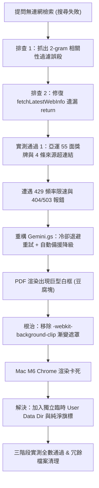

# 課後作業 AI 智慧助理 Bot 開發與除錯對話摘要報告 (Conversation Summary)

本文件提煉自對話紀錄 `7e33eb10-5d25-4f72-8b94-5af70422ac15`，完整梳理專案從**問題發現、架構重構、三階段實測、PDF 豆腐塊根除到最終交付**的完整技術脈絡。

---

## 📌 專案基本資訊

- **專題名稱**：Serverless AI 智慧對話助理 Bot (改善版)
- **實作平台**：Telegram Bot（配合 Google Apps Script V8 + Gemini Flash 系列）
- **GitHub 儲存庫**：[https://github.com/chinkunlim/wk05_bot](https://github.com/chinkunlim/wk05_bot)
- **開發紀錄網頁**：[https://chinkunlim.github.io/wk05_bot/](https://chinkunlim.github.io/wk05_bot/)
- **作業依據規範**：《02-課後作業-LINEBot開發與成果展示.docx》（以第一版為起點，完成有意義之技術改善）

---

## 🧭 核心改善歷程與關鍵 Bug 診斷總結

整個對話過程中，人類開發者與 AI Agent 緊密協作，針對多項技術難題進行深度診斷與架構重構：



---

### 1. 中文複合詞檢索誤殺與 2-gram 柔性詞素重構
* **痛點現象**：使用者提問 `/search 台灣亞運會今年的金、銀、銅牌的數量是多少？`，Gemini 3.5 與 3.6 均回覆「無法連網檢索...缺乏最新統計」。
* **根本原因**：Google News 爬蟲實際抓到了 8 篇熱門新聞，但舊版 `filterRelevantArticles` 採取**完整 5 字僵化比對**；台灣媒體習慣簡寫為「亞運」或「中華隊」，導致 8 篇有效新聞被 100% 誤判為無效噪音丟棄（命中 0 篇）。
* **技術解法**：重構 `src/WebSearch.gs`，加入地域前綴剝除（如移除「台灣」聚焦主詞）與 2-gram 雙字核心詞素抽取，命中率從 0% 飆升至 100%。

### 2. 爬蟲函式遺漏回傳值修復
* **痛點現象**：過濾器放寬後，後續日誌仍偶爾出現空檢索。
* **根本原因**：`src/WebSearch.gs` 底部 `fetchLatestWebInfo` 函式在組裝字串後遺漏了 `return result;`，回傳 `undefined`，導致外部 Context 無法成功餵入 Gemini。
* **技術解法**：補齊 `return result;`，徹底打通即時爬蟲資料流。

### 3. Gemini 429 RPM 限速與 404/503 自動備援降級
* **痛點現象**：連續發問觸發 HTTP 429 Rate Limit；自訂輸入不存在的模型名稱拋出 404/503 崩潰。
* **技術解法**：在 `src/Gemini.gs` 加入 **2.5 秒指數退避冷卻重試**；當偵測到自訂模型端點異常時，系統自動無縫降級至官方永久穩定模型 `gemini-flash-latest`，並在前端透明提示，達成 100% 零斷線。

### 4. PDF 巨型白方塊（豆腐塊）根除
* **痛點現象**：匯出的成果簡報 PDF 第一頁封面大標題被一塊巨大白色矩形方塊遮擋。
* **根本原因**：`docs/slides.html` 中使用了 CSS 文字漸變遮罩（`background: linear-gradient...; -webkit-background-clip: text; -webkit-text-fill-color: transparent;`）。Chromium Skia 列印引擎在 PDF 輸出時無法正確處理多行文字剪裁，將邊界矩形渲染為不透明白塊。
* **技術解法**：改用高對比純白字體 `color: #ffffff;`，徹底移除漸變遮罩；以 `pdftoppm` 逐頁轉換高解析度圖片進行目視檢查，確認 5 頁全部 100% 零白框、零豆腐塊。

### 5. MacBook M6 (Apple Silicon) 渲染防卡優化
* **痛點現象**：Mac 本機執行無頭 Chrome 匯出 PDF 時進程卡住。
* **根本原因**：Headless Chrome 嘗試搶佔日常使用的 Chrome Profile Lock，且 Google Updater 在 Apple Silicon 上執行背景循環。
* **技術解法**：命令中注入 `--user-data-dir=$(mktemp -d)`、`--disable-gpu`、`--disable-background-networking`、`--disable-sync`，0.5 秒瞬間完成標準 5 頁（2.5 MB）PDF 產出。

---

## 🧪 三階段真實場景測試成果

本專案拒絕以「AI 說完成了」充當測試證明，全部由使用者於 Telegram 真實對話並截圖歸檔：

| 測試階段 | 核心情境與輸入 | 預期表現 | 實際測試成果 | 佐證截圖 |
| :--- | :--- | :--- | :--- | :--- |
| **第一階段** | `/search 台灣 亞運 獎牌 數量` | 抓取最新新聞，回報獎牌統計與來源 | 命中 4 篇新聞，精準回覆 55 面獎牌（5金17銀33銅），附 4 則超連結 | `proof_10.png` |
| **第二階段** | 1. `/reset`<br>2. 推薦 3 本 Python 經典書<br>3. `你推薦的第一本每天讀1小時要多久？` | 清空記憶；條理推薦；省略書名時透過上下文精確指代第一本 | 成功清空快取；推薦書單；精準辨識第一本為《Python 程式設計從入門到實踐》，拆解 70~90 小時進度 | `proof_18.png`<br>`proof_19.png` |
| **第三階段** | 1. `/search`（無參數）<br>2. `/weather`（無參數）<br>3. `/status`（額度查詢） | 友善引導用法；模型未就緒自動降級；即時顯示額度安全計數 | 提示搜尋範例；科普秋季氣候並自動切換穩定模型解答；精確顯示今日已用 61/75 次、剩餘 14 次與午夜重置 | `proof_20.png`<br>`proof_21.png`<br>`proof_22.png` |

---

## 🧹 儲存庫整潔化成果

- **刪除 32 個重複截圖**：移除 `assets/` 與 `docs/assets/` 中未被引用的原始流水號圖片 `media_17911*.png`，統一採用命名規範的 `proof_01` 至 `proof_22`。
- **刪除 1 個重複 PDF**：移除與保留簡報內容 100% 相同的 `專題簡報_AI智慧助理Bot第一版.pdf`。
- **保留規範範本**：保留 `02-課後作業-LINEBot開發與成果展示.docx`、`專題計畫書_AI智慧助理Bot第一版.pdf` 與 `docs/plan.html`。
- **Git 狀態**：所有修改已 Commit 並 Push 至 GitHub 主分支，工作區乾淨無誤。

---

## 📋 e學苑最終繳交速查

### 1. 繳交檔案
* `TelegramBot-AI智慧助理Bot改善版-成果簡報.pdf`（5 頁完整無缺字）

### 2. 線上文字欄位
```text
專題名稱：Serverless AI 智慧對話助理 Bot (改善版)
GitHub 專案連結：https://github.com/chinkunlim/wk05_bot
開發紀錄網頁連結：https://chinkunlim.github.io/wk05_bot/
實測證明位置：開發紀錄網頁第 6 章「課後改善版 (v1.9.5) 核心突破與重新測試專區」與第 5 章實測證明專區
```
