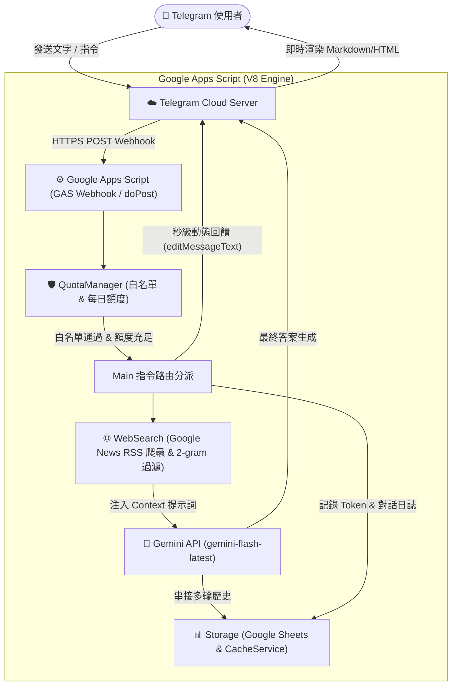
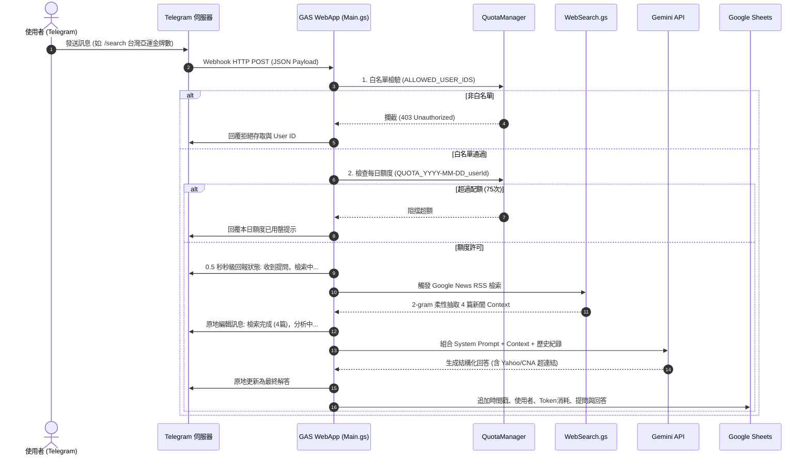

# 系統架構設計與服務架構圖 (System Architecture)

本專案採用 **100% 雲端原生 (Serverless)** 設計，以 Google Apps Script (GAS) 作為核心運算層，全面整合 Telegram Bot API、Google Gemini API、Google News RSS 即時爬蟲以及 Google 試算表（Google Sheets）作為持久化日誌儲存庫，達成 0 主機成本、24/7 常駐在線與雙重額度安全保護的生產級架構。

---

## 🏛️ 全域架構拓撲圖

---

## 🔄 詳細端到端資料流 (Sequence Diagram)

---

## 🧩 核心模組職責劃分

| 模組路徑 | 模組名稱 | 職責與關鍵技術 |
| :--- | :--- | :--- |
| `src/Config.gs` | 設定與金鑰管理 | 封裝 `PropertiesService`，動態解析 `GEMINI_MODEL`、白名單與環境常數，徹底杜絕硬編碼。 |
| `src/QuotaManager.gs` | 存取控制與配額安全 | 實作雙重額度防禦：嚴格白名單攔截 + 每日計數器（`ScriptProperties`），保護免費用量不被爆破。 |
| `src/WebSearch.gs` | 雲端原生檢索 (Grounding) | 透過 `UrlFetchApp` 抓取 Google News RSS，支援地域前綴剝除與 2-gram 雙字核心詞素過濾，突破訓練截止期。 |
| `src/Gemini.gs` | LLM 大腦與對話上下文 | 組合多輪對話快取、System Prompt 與 Grounding Context；實作 429 退避重試與 404/503 自動備援模型降級。 |
| `src/Telegram.gs` | Telegram Bot 通訊 | 封裝 `sendMessage`、`editMessageText` 原地狀態動態變更、4096 字元自動分頁與 HTML/Markdown 解析降級。 |
| `src/Storage.gs` | 日誌持久化與快取 | 處理試算表自動初始化表頭與追加日誌（包含 Prompt/Completion Tokens），並調用 `CacheService` 維護短期對話記憶。 |
| `src/Main.gs` | Webhook 進入點與路由器 | 實作 `doPost` 與 `doGet`，統一控管身分檢驗 ➔ 指令解析 ➔ 原地回饋 ➔ 模型推論 ➔ 日誌寫入之全流程。 |
